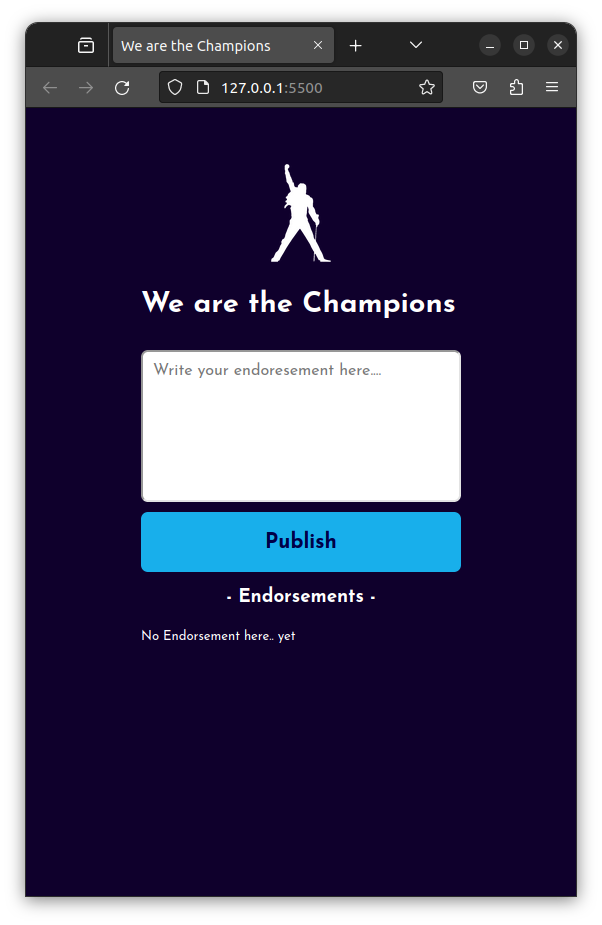

# We are the Champions

"We are the Champions" is a simple web application that allows users to share endorsements. It's a basic project to showcase how to integrate Firebase with HTML, CSS, and JavaScript.

## Table of Contents

- [screenshot](#screenshot)
- [Features](#features)
- [Getting Started](#getting-started)
- [Usage](#usage)

## screenshot

## Features

- Users can add endorsements with a text message.
- Endorsements are displayed in a list.
- Endorsements can be removed by double-clicking them.
- Real-time updates using Firebase.

## Getting Started

Follow these instructions to get a copy of the project up and running on your local machine.

### Prerequisites

- Web browser (Google Chrome, Mozilla Firefox, etc.)
- Firebase account and Firebase Realtime Database setup (update your Firebase configuration in `script.js`).

## Usage

- Enter your endorsement in the textarea and click the "Publish" button to add it to the list.
- Double-click an endorsement to remove it.

